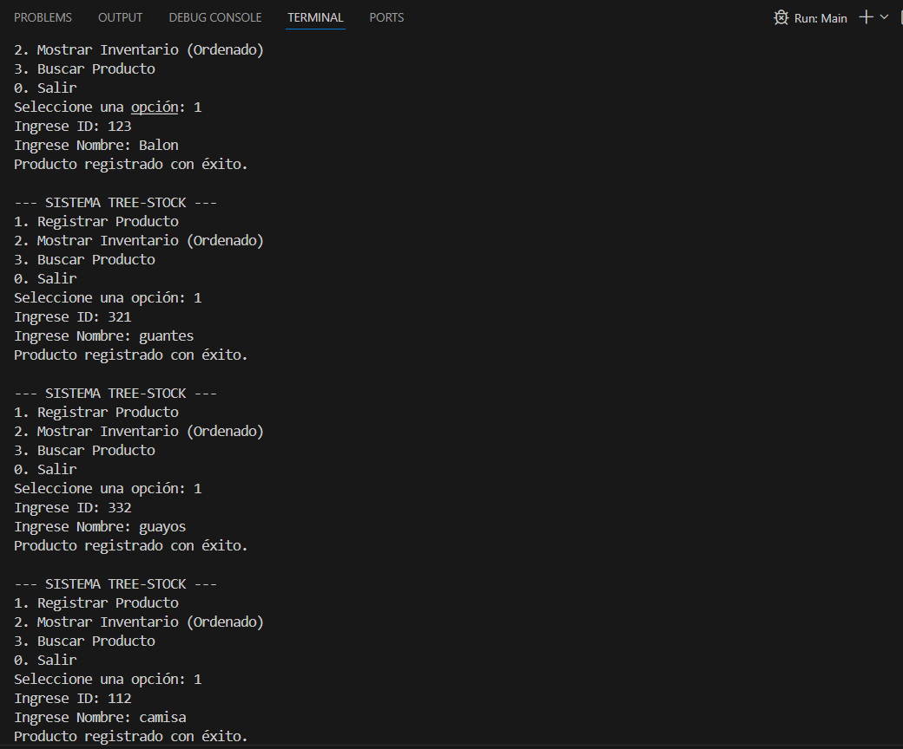
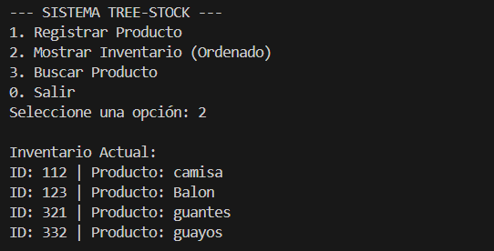
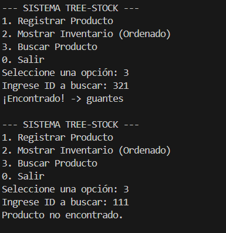

# Proyecto: Sistema de Inventario "Tree-Stock" (Árboles Binarios)

Este es el desarrollo de una aplicación de consola en Java para gestionar el inventario de una tienda mediante un árbol binario de búsqueda. El objetivo es organizar productos por su ID de forma automática.

## 🛠️ Cómo funciona
El programa se divide en tres partes para mantener el código organizado:
1. **Producto.java:** Define el nodo del árbol con su ID, nombre y los punteros para los hijos izquierdo y derecho.
2. **ArbolInventario.java:** Aquí está toda la lógica de recursividad para insertar productos, buscarlos y listarlos de forma ordenada (Inorden).
3. **Main.java:** Es el menú que interactúa con el usuario.

## 🚀 Instrucciones para probarlo
1. Clona el repositorio:
   ```bash
   git clone [https://github.com/danielduarte-gitt/Tree-Stock-Inventario.git](https://github.com/danielduarte-gitt/Tree-Stock-Inventario.git)

   ## 🎥 Sustentación del Video
En este video explico cómo funcionan los punteros en el árbol y por qué usamos recursividad para que el sistema sea eficiente:

👉 [Ver video de sustentación aquí](https://drive.google.com/file/d/10HDZATkfOXxmG5sMw0UdBHti1J4i1mpM/view?usp=drive_link)
   


